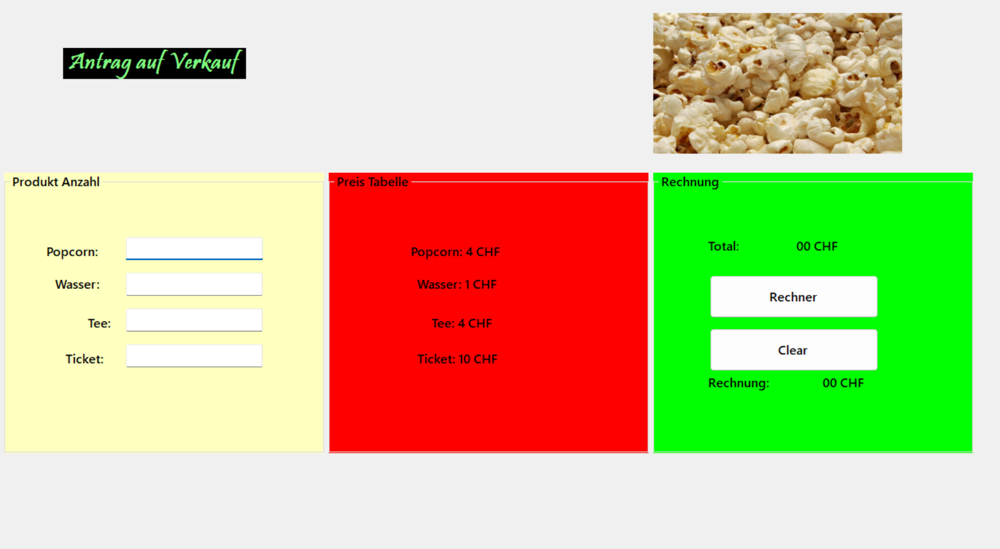
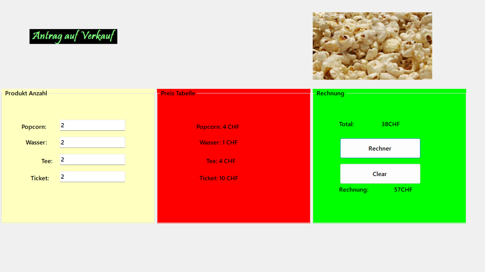
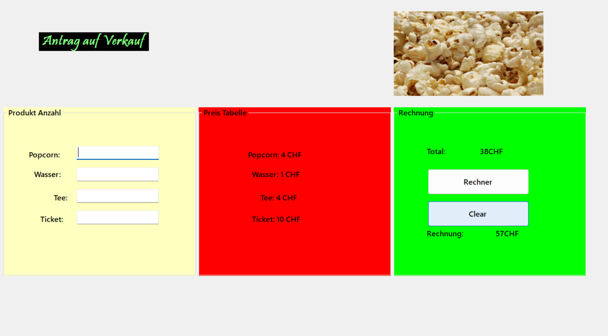

# Cinema Büfett-Anwendung

## Projektbeschreibung

Die Cinema Büfett-Anwendung ist eine Windows Forms-Anwendung, die mit dem .NET Framework entwickelt wurde. Diese Anwendung erleichtert die Verwaltung eines Kino-Büfetts, indem sie die Zahlungen der Kunden verfolgt und die Verkaufszahlen anzeigt.

## Funktionen

- **Kundenbezahlungen**: Berechnen und erfassen Sie den zu zahlenden Betrag für jeden neuen Kunden.
- **Verkaufsberichterstattung**: Zeigen Sie nach jedem Kunden, wie viel Umsatz insgesamt gemacht wurde.
- **Benutzerfreundliche Oberfläche**: Bietet eine benutzerfreundliche Erfahrung durch eine grafische Oberfläche, die auf Windows Forms basiert.

## Verwendete Technologien

- **Programmiersprache**: C#
- **Framework**: .NET Framework
- **Oberfläche**: Windows Forms

## Installation

1. **Voraussetzungen**:
   - Microsoft .NET Framework
   - Visual Studio oder eine kompatible IDE

2. **Installationsschritte**:
   - Laden Sie das Projekt herunter oder klonen Sie es.
   - Öffnen Sie das Projekt in Visual Studio.
   - Kompilieren und führen Sie die Anwendung aus.

## Screenshots

### 

### 

### 

### 

## Funktionen und Merkmale

- **Variablen**: Zur Speicherung der Zahlungs- und Gesamtverkaufsbeträge verwendet.
- **Werkzeuge**: Grafische Benutzeroberfläche mit Windows Forms-Werkzeugen erstellt.
- **Tastatureingaben**: Eingaben von Benutzerdaten über die Tastatur ermöglichen.

