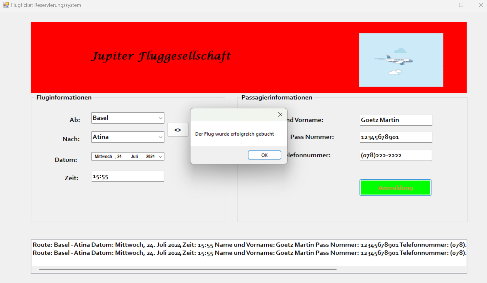
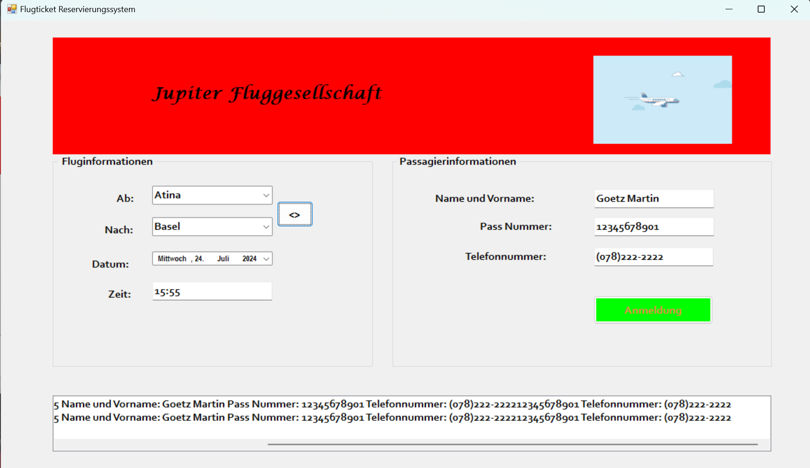
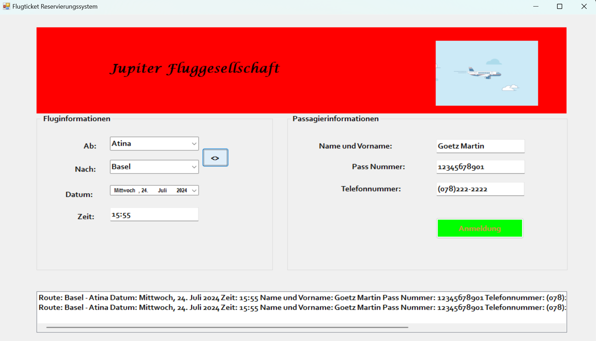

# Flugticket-Reservierungssystem Projekt

Dieses Projekt ist eine Anwendung zur Durchführung von Flugticketreservierungen. Die Anwendung ermöglicht es Benutzern, ihre Fluginformationen einzugeben und die Ticketreservierungen zu verwalten.

## Funktionen

- **Algorithmus zum Ändern der Abflug- und Ankunftsorte:** Benutzer können die Abflug- und Ankunftsorte dynamisch ändern.
- **Benutzeroberflächenkomponenten:**
  - `GroupBox` (Zwei Stück)
  - `Panel`
  - `Button`
  - `ListBox`
  - `ComboBox`
  - `DateTimePicker`
  - `MaskedTextBox`

## Verwendete Technologien

- **Sprache:** C#
- **IDE:** Visual Studio (oder eine andere C# Entwicklungsumgebung)

## Bildschirmfotos

Im Folgenden sind vier Bildschirmfotos der verschiedenen Ansichten der Anwendung aufgeführt:

1. **Flugticket-Reservierungssystem**
   

2. **Flugticket-Reservierungssystem**
   

3. **Flugticket-Reservierungssystem**
   

## Gebrauchsanweisung

1. **Anwendung Starten:** Öffnen und starten Sie das Projekt mit Visual Studio oder einer geeigneten IDE.
2. **Fluginformationen Eingeben:** Geben Sie Abflugort, Ankunftsort, Datum und andere erforderliche Informationen ein.
3. **Reservierung Vornehmen:** Klicken Sie auf den entsprechenden Button, um die Reservierung abzuschließen.
4. **Ergebnisse Anzeigen:** Anzeigen der erfolgreich durchgeführten Reservierung und Fluginformationen.

## Algorithmus-Erklärung

Die Anwendung verwendet einen Algorithmus, der es ermöglicht, die Abflug- und Ankunftsorte zu ändern. Dieser Algorithmus ermöglicht es den Benutzern, ihre Präferenzen dynamisch zu aktualisieren und die richtigen Fluginformationen zu erhalten.

