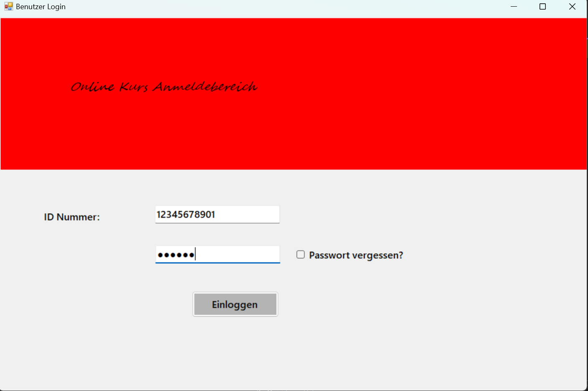

# Online Kurs Anmeldebereich

Dieses Projekt ist ein einfaches Anmeldefeld für den Zugriff auf Online-Kurse. Es wurde mit Windows Forms entwickelt und enthält die grundlegenden Komponenten, die für die Anmeldung an einer Kursplattform erforderlich sind.

## Funktionen

- **Benutzeranmeldung**: Möglichkeit zur Anmeldung mit Benutzername und Passwort.
- **Passwort merken**: Option zum Speichern des Passworts für zukünftige Anmeldungen.
- **Passwort vergessen**: Möglichkeit, einen Link zum Zurücksetzen des Passworts anzufordern, wenn das Passwort vergessen wurde.

## Verwendete Komponenten

- **MaskedTextBox**: Formatierte Eingabe für Benutzernummer oder andere Daten.
- **Button**: Schaltflächen für Anmeldungen, Passwortzurücksetzungen und andere Aktionen.
- **CheckBox**: Zusätzliche Optionen wie "Passwort merken".
- **TextBox**: Eingabefelder für Benutzername und Passwort.
- **Label**: Beschriftungen zur Anzeige von Informationen und Anweisungen.
- **Panel**: Visuelle Organisation und Layout des Formulars.

## Verwendung

- **Anmelden**: Geben Sie Ihren Benutzernamen und Ihr Passwort ein und klicken Sie auf die Schaltfläche „Anmelden“.
- **Passwort merken**: Aktivieren Sie die Option „Passwort merken“, um Ihr Passwort für zukünftige Anmeldungen zu speichern.
- **Passwort vergessen**: Wenn Sie Ihr Passwort vergessen haben, klicken Sie auf „Passwort vergessen“, um Anweisungen zum Zurücksetzen des Passworts zu erhalten.

## Screenshots

Hier sind einige Screenshots des Projekts:

*Hauptfenster des Anmeldebereichs*

