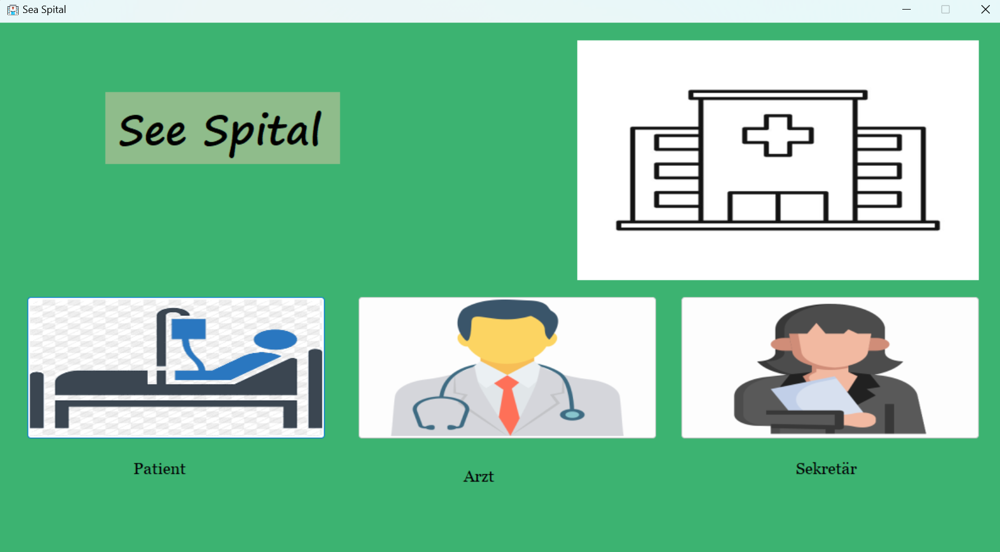
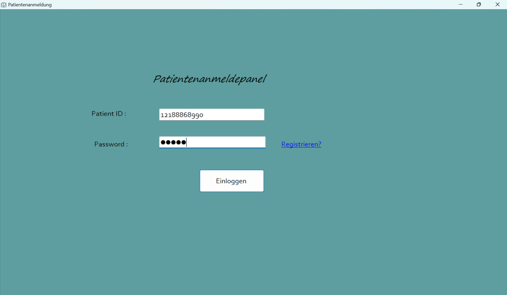
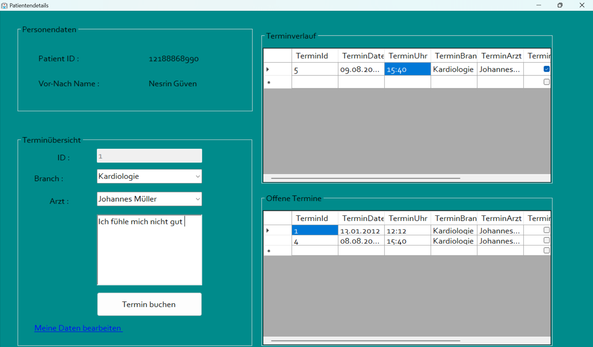
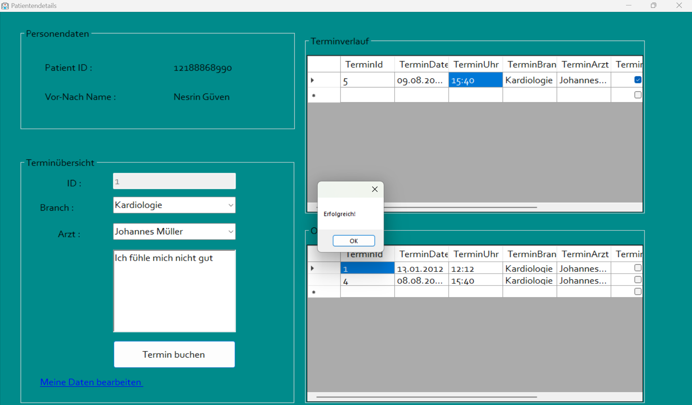
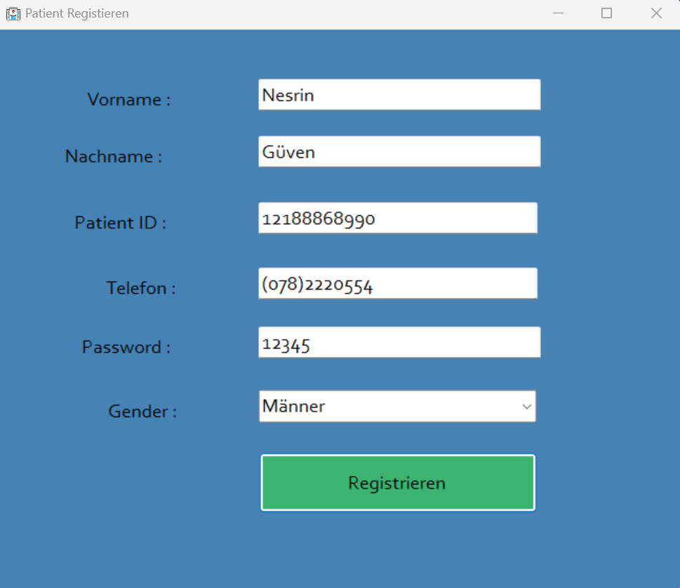
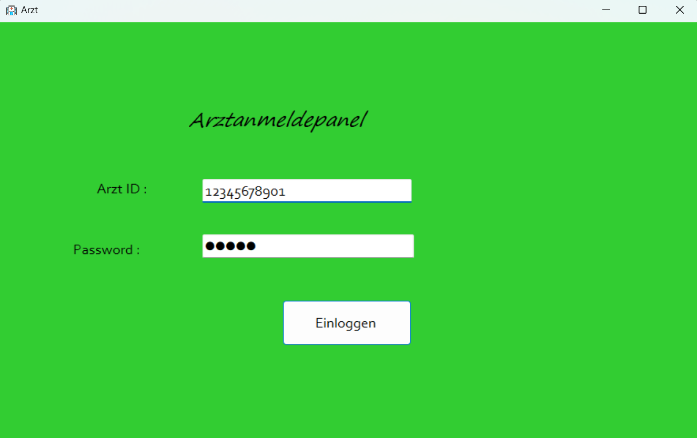
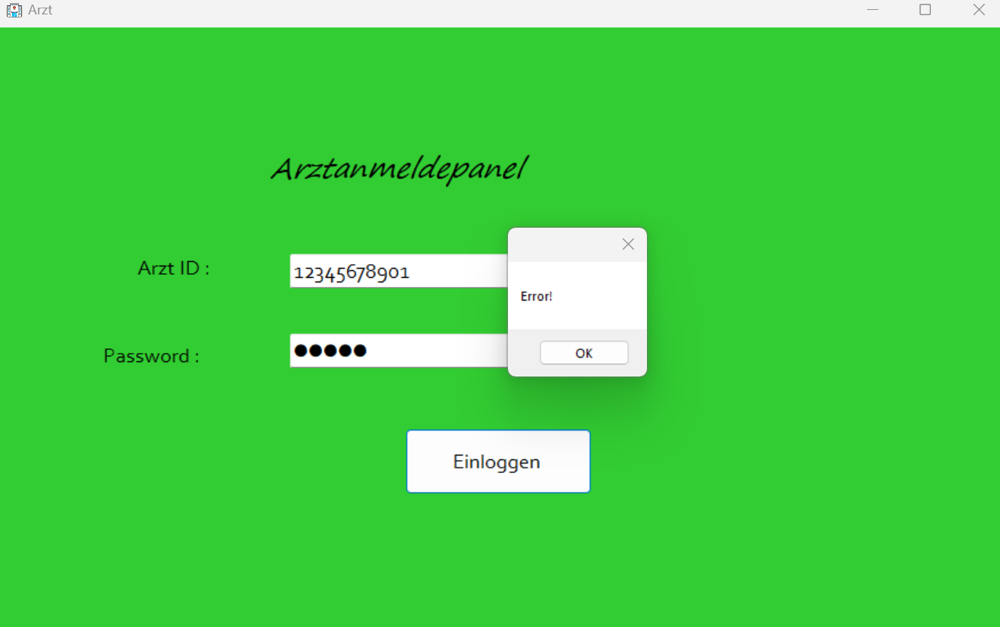
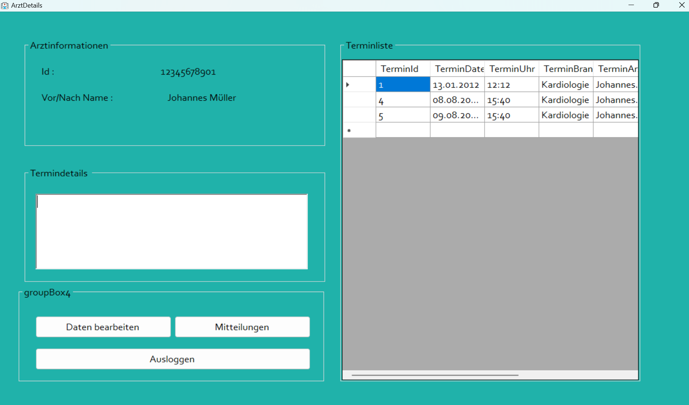
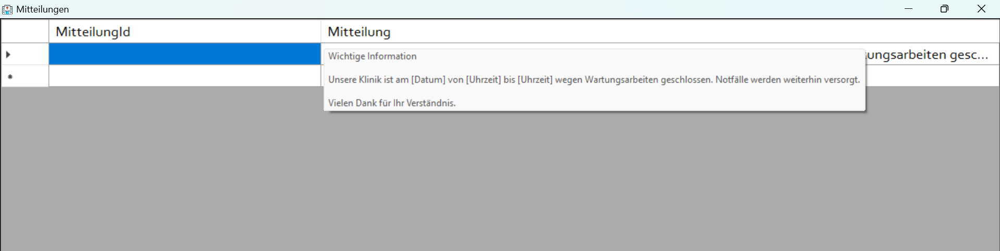

# Krankenhaus-Management-System

Dieses Projekt ist ein **Krankenhaus-Management-System**, das mit **C# Windows Forms App (.NET Framework)** entwickelt wurde. Das Programm besteht aus drei Hauptbereichen: **Patienten-Login**, **Arzt-Login** und **Sekretär-Login**. Benutzer können sich mit ihren Anmeldeinformationen im System anmelden und verschiedene Aktionen entsprechend ihren Berechtigungen ausführen.

## Inhaltsverzeichnis
- [Allgemeine Informationen](#allgemeine-informationen)
- [Funktionen](#funktionen)
  - [Patienten-Login](#patienten-login)
  - [Arzt-Login](#arzt-login)
  - [Sekretär-Login](#sekretär-login)
- [Datenbank](#datenbank)

## Allgemeine Informationen

Dieses Programm ist ein Krankenhaus-Management-System, das mit **C# Windows Forms App (.NET Framework)** entwickelt wurde. Benutzer können sich als Patienten, Ärzte oder Sekretäre im System anmelden, wobei jeder Benutzerrolle spezifische Bildschirme und Funktionen zugewiesen sind.

## Funktionen

### Home-Page


### Patienten-Login

- **Anmeldung:** Patienten melden sich mit ihrer Passnummer und ihrem Passwort im System an.
  
  
- **Aktuelle Termine:** Nach der Anmeldung werden die aktuellen Termine des Patienten angezeigt.
  
  
- **Neuer Termin:** Der Patient kann eine neue Terminvereinbarung treffen, indem er seine Beschwerde eingibt.
  
  
- **Daten bearbeiten:** Der Patient kann über die Schaltfläche "Meine Daten bearbeiten" seine vorhandenen Daten aktualisieren. Alle Änderungen werden automatisch in der SQL-Datenbank gespeichert.
  

### Arzt-Login

- **Anmeldung:** Ärzte melden sich mit ihrer ID-Nummer und ihrem Passwort im System an. Bei falschen Anmeldeinformationen wird eine Fehlermeldung angezeigt, und der Benutzer wird aufgefordert, sich erneut anzumelden.
  
  
  
- **Terminliste:** Der Arzt kann seine Terminliste einsehen und durch Klicken auf einen Termin die Beschwerde des Patienten einsehen.
  
  
- **Daten bearbeiten:** Der Arzt kann über die Schaltfläche "Daten bearbeiten" seine persönlichen Informationen aktualisieren.
  
  
- **Mitteilungen:** Der Arzt kann über die Schaltfläche "Mitteilungen" die neuesten Ankündigungen einsehen.
  
  
- **Ausloggen:** Der Arzt kann über die Schaltfläche "Ausloggen" das System vollständig verlassen.

### Sekretär-Login

- **Anmeldung:** Sekretäre melden sich mit ihrer ID und ihrem Passwort im System an.
  
  
- **Mitteilungen erstellen:** Der Sekretär kann neue Ankündigungen im System erstellen.
  
- **Termin erstellen:** Der Sekretär kann neue Termine für Ärzte erstellen.
  
- **Fachrichtungen und Ärzte:** Der Sekretär kann die vorhandenen Fachrichtungen und Ärzte einsehen.
  
- **Schnellzugriff:** Der Sekretär hat über Schnellzugriffsfelder Zugriff auf die Arzt-, Fachrichtungs-, Termin- und Mitteilungslisten.
  

## Datenbank

In diesem Programm wird **MySQL** als Datenbank verwendet. Patienten-, Ärzte- und Sekretärdaten sowie Termin- und Mitteilungsinformationen werden in der SQL-Datenbank gespeichert und aktualisiert.

## Installation

1. Klonen Sie das Projekt auf Ihren Computer:
   ```bash
   git clone https://github.com/your_username/hospital-automation.git
