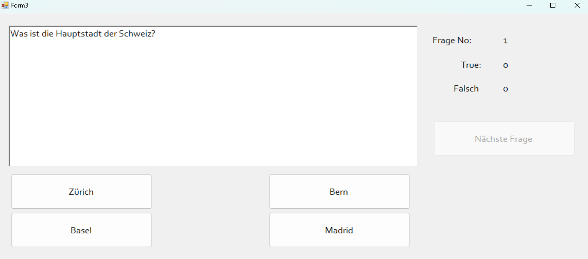
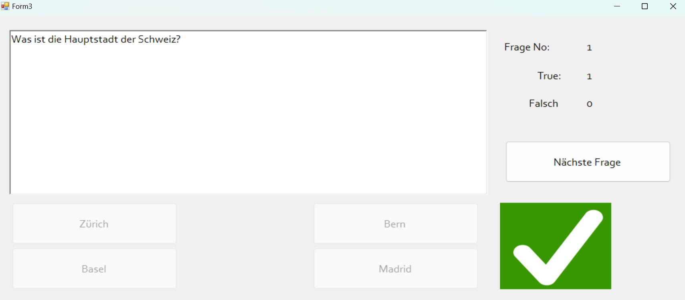
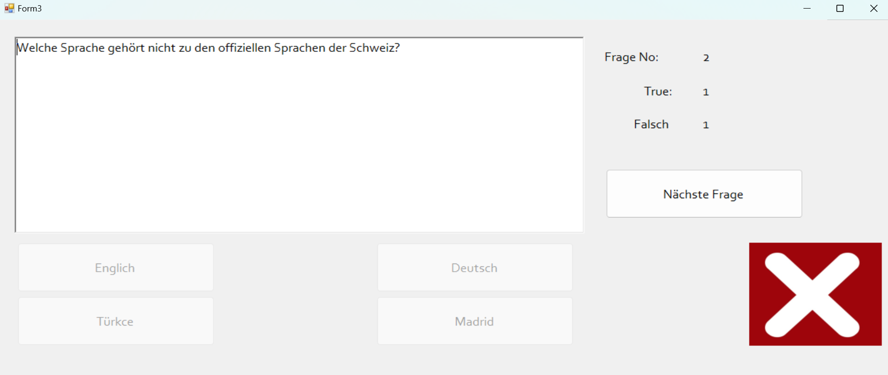
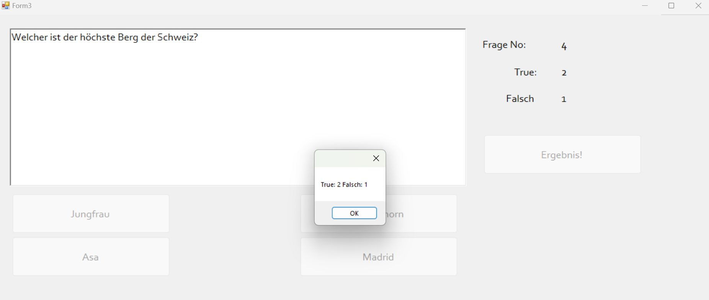

# Quiz-Spiel

Dieses Projekt ist ein Quiz-Spiel, das mit C# und Windows Form App (.NET Framework) entwickelt wurde. Das Spiel präsentiert dem Benutzer 3 Fragen mit jeweils 4 Antwortmöglichkeiten und gibt visuelles Feedback, wenn der Benutzer eine richtige oder falsche Antwort gibt. Zudem wird angezeigt, welche Frage gerade beantwortet wird und wie viele richtige bzw. falsche Antworten der Benutzer gegeben hat.

## Funktionen

- **Frageanzeige:** Dem Benutzer wird jeweils eine Frage mit 4 Antwortmöglichkeiten angezeigt.
- **Antwortüberprüfung:** Wenn der Benutzer eine richtige Antwort gibt, wird ein grünes Häkchen angezeigt, bei einer falschen Antwort ein rotes Kreuz.
- **Fragenstatus:** Der Benutzer kann auf dem Bildschirm sehen, bei welcher Frage er sich befindet und wie viele richtige und falsche Antworten er gegeben hat.
- **Deaktivierung der Antworten:** Der Benutzer kann eine Frage nach der Beantwortung nicht erneut beantworten. Dies wird durch die Verwendung der `Enable`-Eigenschaft erreicht.
- **Verwendete Steuerelemente:** `RichTextBox`, `Label`, `PictureBox`, `Button`-Steuerelemente wurden verwendet.

## Bildschirmfotos

### Hauptbildschirm

### Richtige Antwort

![Richtige Antwort] (Images/Screenshot4.png)

### Falsche Antwort

## Ergebnis

## Verwendete Technologien

- C#
- Windows Forms (.NET Framework)

## Installation und Ausführung

1. Klonen oder laden Sie dieses Projekt auf Ihren Computer herunter.
2. Öffnen Sie das Projekt mit Visual Studio oder einer kompatiblen IDE.
3. Kompilieren und führen Sie das Projekt aus.

